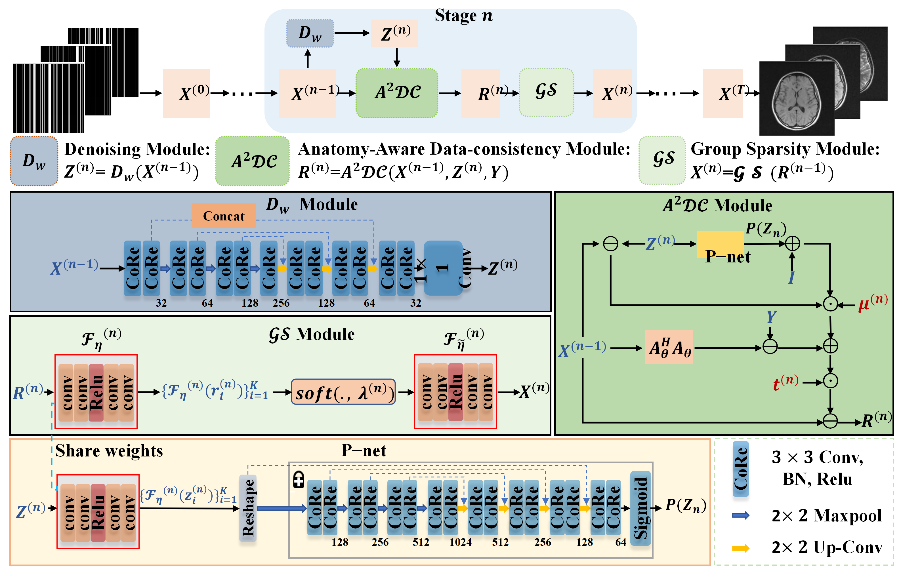

# A²MC-MRI: Anatomy-Aware Deep Unrolling for Task-Oriented Acceleration of Multi-Contrast MRI

## 🔍 Description

**A²MC-MRI** is an anatomy-aware, unrolling-based deep network designed for accelerated multi-contrast MRI (MC-MRI) reconstruction. Unlike traditional methods that prioritize overall image quality, A²MC-MRI is a **task-oriented** framework that focuses on enhancing specific **Targets of Interest (TOIs)**—such as subcortical regions or lesions—to better serve downstream clinical needs[cite: 11, 49].

The framework uniquely integrates:
* [cite_start]**Learnable Group Sparsity**: Captures intrinsic correlations across different contrasts (e.g., T1, T2, FLAIR) in a high-dimensional semantic space[cite: 13, 51].
* [cite_start]**Anatomy-Aware Denoising Prior**: Utilizes a segmentation network (**P-net**) to provide critical location information, enabling specialized denoising for TOIs[cite: 14, 52].
* [cite_start]**Joint Learning**: The unrolled network is trained in tandem with learnable k-space sampling patterns to optimize imaging for specific clinical tasks[cite: 15, 53].

---

## 🧭 Framework Overview

[cite_start]The A²MC-MRI network consists of $T=6$ cascaded stages[cite: 196, 260]. Each stage contains three pivotal modules:
1. [cite_start]**Denoising Module ($D_w$)**: A lightweight U-Net that produces artifact-free images $Z^{(n)}$ from the previous stage output[cite: 202, 204].
2. [cite_start]**Anatomy-Aware Data-Consistency Module ($A^2\mathcal{DC}$)**: Incorporates the pre-trained **P-net** to identify TOIs and applies refined constraints on the discrepancy between the reconstructed and denoised images[cite: 202, 210, 216].
3. [cite_start]**Group Sparsity Module (GS)**: Enhances cross-contrast information fusion using $l_{2,1}$-norm-based sparsity in the feature domain[cite: 202, 218, 222].



---

## 📦 Requirements & Dependencies

* [cite_start]**OS**: Ubuntu 20.04 [cite: 259]
* **GPU**: NVIDIA RTX 3090Ti [cite: 259]
* **Environment**: Python 3.10+, PyTorch 2.6.0+
* **Key Libraries**: `monai`, `nibabel`, `numpy`, `scipy`, `einops`

---

## 🗂 Data Preparation & Preprocessing

The model has been evaluated on three datasets with high acceleration rates (8x and 10x)[cite: 54, 239]:

| Dataset | Contrasts | Target of Interest (TOI) | System |
| :--- | :--- | :--- | :--- |
| **M4Raw** | T1WI, T2WI, FLAIR | Brain subcortical regions [cite: 244] | 0.3T [cite: 241] |
| **fastMRI** | PDWI, FS-PDWI | Knee lesion / meniscus regions [cite: 249] | 1.5/3.0T [cite: 246] |
| **In-house** | T1WI, T2WI, FLAIR | Whole brain tissue [cite: 252] | 3.0T [cite: 250] |

### Preprocessing Workflow:
1. **Undersampling**: Original k-space data is undersampled using learnable or fixed masks[cite: 253].
2. **Sensitivity Maps**: Multi-coil data uses maps pre-estimated via the **ESPIRIT** algorithm[cite: 256].
3. **Normalization**: Ground-truth images are reconstructed using 2D Inverse Fourier Transform for individual or combined coils[cite: 254, 255].

---

## 🚀 Training & Usage

### Loss Function
The network is trained using a composite loss function[cite: 232]:
$$\mathcal{L}(\Theta) = \mathcal{L}_{consistency} + \alpha\mathcal{L}_{constraint} + \beta\mathcal{L}_{anatomy} + \gamma\mathcal{L}_{dice}$$
* [cite_start]**$\mathcal{L}_{consistency}$**: Global image fidelity[cite: 233].
* **$\mathcal{L}_{anatomy}$**: Refinement specifically within the TOIs[cite: 234].
* **$\mathcal{L}_{dice}$**: Promotes accurate segmentation of TOIs in reconstructed images[cite: 235].

### Training Script
```bash
python train.py --dataset M4Raw --stages 6 --batch_size 4 --lr 1e-4 --accel 10
